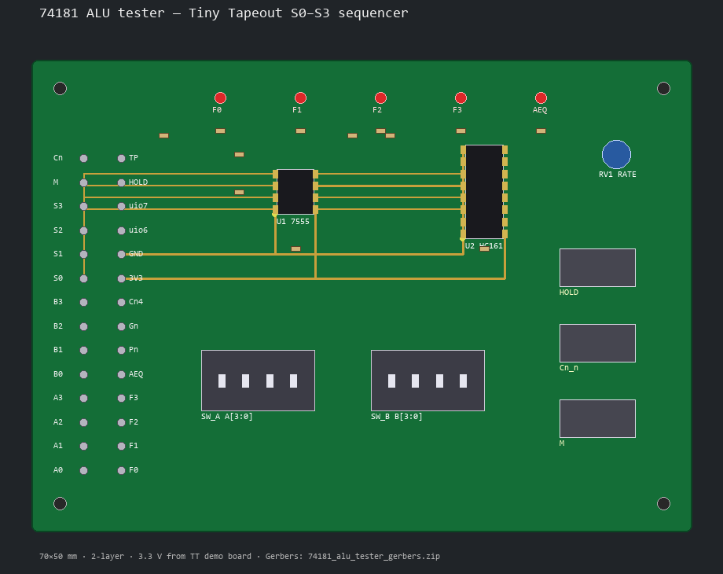

# 74181 ALU test PCB

Auto-exerciser for the Tiny Tapeout **74181 ALU** chip (`tt_um_brightwaterfall_alu74181`).

## Board preview

## What it does

With **A**, **B**, **M**, and **Cn_n** on switches:

1. **7555/555** clocks a **74HC161**
2. **Q0–Q3 → S0–S3**
3. S runs **0→1→…→15→0…** (every function, one after another)
4. LEDs show **F[3:0]** and **AeqB**
5. **HOLD** freezes the current S value

Power and ground come from the **Tiny Tapeout demo board** (3.3 V). This PCB is an optional daughter / header harness — it does not replace the TT demo board.

## Fabrication (Gerbers ready)

| File | Purpose |
|------|---------|
| **[74181_alu_tester_gerbers.zip](74181_alu_tester_gerbers.zip)** | Upload to JLCPCB / PCBWay |
| **[pcb_render.png](pcb_render.png)** | Top-view preview |
| [gerbers/](gerbers/) | Unpacked Gerber + Excellon |
| [generate_board.py](generate_board.py) | Regenerate Gerbers + preview (`py -3 generate_board.py`) |

**Board:** 70×50 mm · 2-layer · 1.6 mm · HASL · min track 0.25 mm

## Design docs

| File | Purpose |
|------|---------|
| [BRINGUP.md](BRINGUP.md) | Power-on / usage |
| [SCHEMATIC.md](SCHEMATIC.md) | Net / wiring |
| [schematic_sequencer.svg](schematic_sequencer.svg) | Block schematic |
| [bom.csv](bom.csv) | BOM + LCSC hints |
| [connections.csv](connections.csv) | Header ↔ TT pins |
| `74181_alu_tester.kicad_pro` / `.kicad_sch` / `.kicad_pcb` | KiCad project shell (outline + notes) |

## Viewer (chip layout)

GitHub Pages + TT viewer: https://brightwaterfall.github.io/ALU74181/
